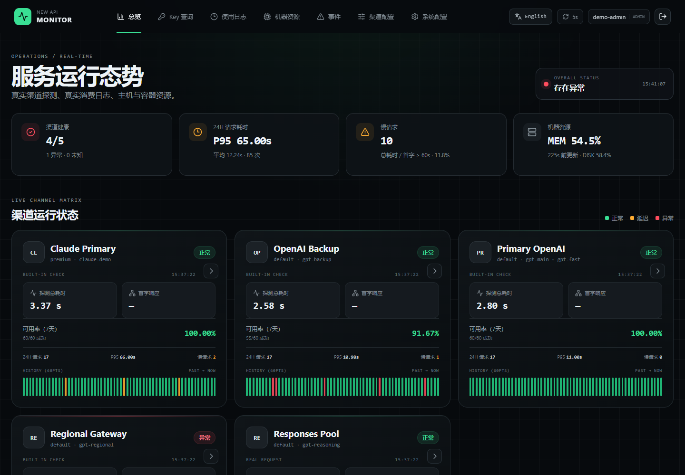
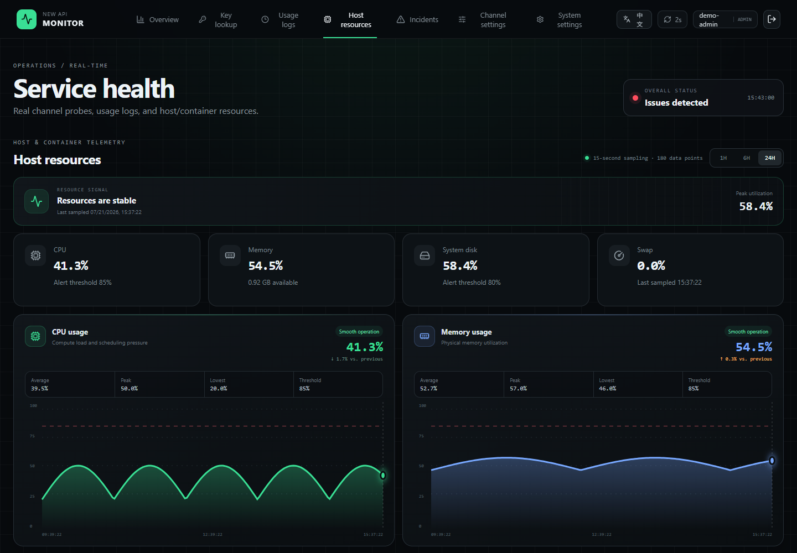
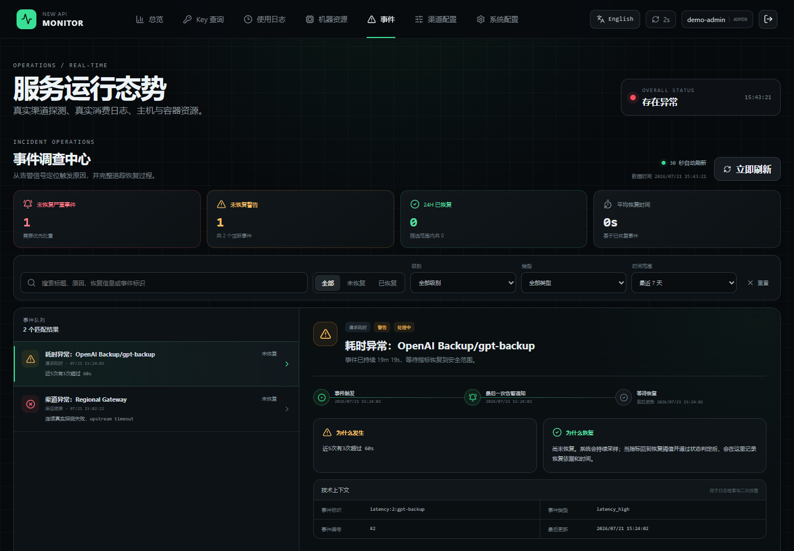

# New API 外置监控平台

[简体中文](README.md) | [English](README_EN.md)

[](https://github.com/li0on3/newapi-monitor/actions/workflows/ci.yml)
[](https://github.com/li0on3/newapi-monitor/actions/workflows/codeql.yml)
[](LICENSE)

独立部署、无需修改 New API 源码的监控与告警平台。它通过 New API 管理接口、真实 Relay 请求、真实使用日志和 Docker 只读接口采集数据，适合单机或小规模 New API 环境。

## 界面预览

以下截图全部由内置演示数据生成，不包含真实渠道、用户、API Key、域名、IP、令牌或调用记录。

### 渠道总览



### 主机与容器资源



### 事件调查中心



## 核心能力

- 启用渠道自动同步，禁用渠道自动隐藏；支持 OpenAI Responses、Chat Completions 和 Anthropic Messages 真实探测。
- 使用 New API 原始使用日志分析总耗时、首字耗时、用户、令牌、模型和渠道。
- 支持按 API Key 即时查询真实额度、模型限制和最近调用详情；Key 仅在单次请求内存中转发，不落库、不进入 URL 和配置审计。
- 最近 5 次中 3 次或最近 10 次中 5 次超过慢请求阈值时告警；单次超过严重阈值立即告警。
- 宿主机 CPU、内存、磁盘以及 Docker 容器资源、状态、重启和 OOM 监控。
- 渠道、日志、资源和渠道同步采集器的新鲜度自检，防止“监控页面还活着但数据已经停止更新”。
- 邮件、企业微信自建应用、企业微信群机器人、飞书自建应用和飞书群机器人多渠道通知；单个渠道故障不阻断其他渠道，支持页面配置与真实测试。
- 所有通知渠道共用结论优先、异常优先的人类可读报告；邮件同时提供响应式 HTML 卡片和纯文本降级内容。
- New API Session 单点登录、角色映射、紧急管理员、登录限速和配置审计。
- 中英文界面自动跟随浏览器语言，也可在页面右上角手动切换并持久化偏好。
- 页面动态配置，不写回 New API，不影响 New API 升级。
- 管理端与普通用户可使用独立的总览渠道清单；隐藏渠道只影响对应角色的展示和状态汇总，不停止探测、日志采集或告警。
- 通过 OpenAI 官方 JSON 状态接口同步整体状态、组件和事件，将官方故障与本地真实探测关联；默认不纳入本地 `OVERALL STATUS`，也不会自动修改或禁用 New API 渠道。

## 快速部署

### Linux 一键安装（推荐）

```bash
curl -fsSL https://github.com/li0on3/newapi-monitor/releases/latest/download/install.sh | sudo bash
```

若新机器尚未安装 Docker，请先审阅 [Docker 官方安装脚本](https://get.docker.com)，再显式允许安装：

```bash
curl -fsSL https://github.com/li0on3/newapi-monitor/releases/latest/download/install.sh | sudo bash -s -- --install-docker
```

安装器会校验发布包 SHA-256、拉取固定版本的 GHCR 多架构镜像、默认仅绑定 `127.0.0.1:18081`，并一次性显示 15 分钟有效的初始化令牌、紧急管理员随机密码和 SSH 隧道命令。

浏览器打开 `http://127.0.0.1:18081/monitor/`，在初始化向导中填写 New API 地址与管理员账号。管理员密码只用于向 New API 换取管理令牌和独立探测 Key，不会写入监控数据库。也可切换为“已有令牌”模式手工填写。

远程服务器在配置 HTTPS 反向代理前，可使用：

```bash
ssh -L 18081:127.0.0.1:18081 user@server
```

### 日常运维

```bash
sudo monitorctl status
sudo monitorctl doctor
sudo monitorctl logs
sudo monitorctl backup
sudo monitorctl update
sudo monitorctl rollback
sudo monitorctl reset-admin
```

`monitorctl update` 会先在线备份 SQLite 和加密密钥环境文件，再升级到最新 release；`rollback` 会切回上一次镜像。首次初始化令牌过期时运行 `sudo monitorctl renew-setup`。

需要修改代码时仍可克隆仓库，执行 `python3 manage.py init` 后使用 `docker compose build monitor` 源码构建。

请使用 Nginx、OpenResty、Caddy 或其他 HTTPS 反向代理对外提供 `/monitor/`。反向代理必须转发全部深层路径：

```text
/monitor/                       总览
/monitor/key-usage              Key 用量查询
/monitor/logs                   使用日志
/monitor/resources              机器资源
/monitor/incidents              事件
/monitor/channels               渠道配置
/monitor/system                 系统配置
/monitor/system/notifications   通知中心
/monitor/system/providers       上游官方状态
```

通知中心的每个已配置渠道均可单独点击“触发测试告警”；渠道无需先启用，但未保存的配置必须先保存，避免测试内容与实际生效配置不一致。

## 健康检查

公开健康检查只返回最少信息：

```bash
curl -fsS http://127.0.0.1:18081/api/health
```

正常：

```json
{"status":"ok","timestamp":1784476800}
```

首次安装尚未完成向导时返回 HTTP 200 和 `{"status":"setup_required"}`，便于容器健康检查通过，但采集线程尚未启动。

以下任一情况返回 HTTP 503：

- SQLite 无法读取；
- 监控主线程停止；
- 渠道同步、渠道探测、日志、资源或已启用的 OpenAI 官方状态采集超过动态失效阈值。

管理员可以在“系统配置 → 运行状态”查看每个采集器最后成功时间、连续失败次数、错误摘要和失效阈值。

## 默认策略

| 项目 | 默认值 |
| --- | ---: |
| 渠道同步 | 5 秒 |
| 日志同步 | 30 秒 |
| 资源采样 | 15 秒 |
| 渠道真实探测 | 5 分钟 |
| OpenAI 官方状态 | 60 秒 |
| 慢请求 | 任一耗时指标超过 60 秒 |
| 窗口告警 | 5 次中 3 次，或 10 次中 5 次 |
| 单次严重告警 | 超过 180 秒 |
| 资源告警 | 超阈值持续 180 秒 |
| 数据保留 | 90 天 |

采集器失效阈值根据采集周期自动计算，通常为采集周期的 3～4 倍，并设置合理的最小宽限时间。

## 数据与安全

- 不保存模型提示词和响应正文，只保存监控所需指标与错误摘要。
- New API 管理 Token、Relay Token、SMTP 密码、企微/飞书应用 Secret、Webhook 地址和签名密钥在 SQLite 中使用 `MONITOR_SECRET_KEY` 加密。
- 生产容器以 UID `10001` 非 Root 用户运行，根文件系统只读，移除全部 Linux capabilities。
- Docker Socket 不直接暴露给监控程序，只通过只读 Socket Proxy 提供必要接口。
- 状态变更接口使用严格 Pydantic Schema、角色校验和同源请求校验头。
- 公共健康接口不返回内部错误、路径和采集详情。
- 监控数据不匿名公开：普通 New API 用户通过现有 Session 登录后默认仅能查看总览；运维员可查看日志、资源、事件与渠道配置；监控管理员可管理系统配置和角色映射。
- Key 用量查询默认仅管理员可用；管理员可在“系统配置 → Key 用量查询”中启停功能、调整最低角色、单次日志数量、查询频率和额度换算单位。
- Key 查询只调用 New API 的只读 `/api/usage/token/` 与 `/api/log/token` 接口，不持久化原始 Key，也不会修改 New API 数据。
- 配置变更和角色变更写入审计表，秘密字段始终脱敏。
- OpenAI Status 采集器每轮只读取固定的 `https://status.openai.com/api/v2/summary.json`，限制响应体与超时时间，不接受用户自定义目标 URL，避免形成 SSRF 能力。
- 官方状态只保留最新快照，事件进展单独写入事件中心，避免 60 秒采集在长期运行后造成 SQLite 无界增长。

详细安全边界见 [SECURITY.md](SECURITY.md)，后续计划见 [ROADMAP.md](ROADMAP.md)，GitHub 维护流程见 [GITHUB_GUIDE.md](GITHUB_GUIDE.md)。

## 备份

```bash
sudo monitorctl backup
```

备份使用 SQLite Online Backup API，同时打包权限为 `0600` 的环境配置。恢复备份时必须持有原来的 `MONITOR_SECRET_KEY`，否则数据库中的敏感配置无法解密。

建议同时安全备份：

- `backups/*.db`
- `.env` 中的 `MONITOR_SECRET_KEY`
- 反向代理配置

不要将以上文件提交到 Git。

## 升级与回滚

升级前：

```bash
sudo monitorctl update
# 如新版本出现回归
sudo monitorctl rollback
```

安装器固定使用 GitHub Release 版本镜像，升级前自动备份并记录上一个镜像。执行重大版本回滚前仍应确认数据库兼容性，必要时恢复对应备份。

## 开发验证

```bash
python -m pip install -r requirements.txt
python manage.py release-check
python -m unittest discover -s tests -v

cd web
bun install --frozen-lockfile
bun run build

cd ..
docker compose --env-file .env.example config --quiet
docker build -t newapi-monitor:test .
```

本地完整联调环境仍可使用：

```bash
docker compose --env-file .env.local -f docker-compose.local.yml up -d --build
```

## 架构原则

1. **测量真实目标**：渠道健康优先使用真实请求，不把仅连通测试等同于真实可用。
2. **监控监控本身**：每条采集链路必须留下最后成功时间，并能产生异常和恢复事件。
3. **最小权限**：只读 API、独立探测 Token、非 Root 容器、回环端口和最小 Docker Socket 权限。
4. **故障隔离**：监控故障不得修改或阻塞 New API 主业务。
5. **拒绝过度设计**：当前使用 SQLite 和单进程调度，适合单机及小规模环境；只有容量和可靠性目标发生变化时才引入外部时序数据库或消息队列。

同机部署不能检测整机失联。如果需要主机宕机告警，应增加一个独立于目标服务器的外部 HTTP 心跳检查，而不是继续在同一台机器堆叠组件。
