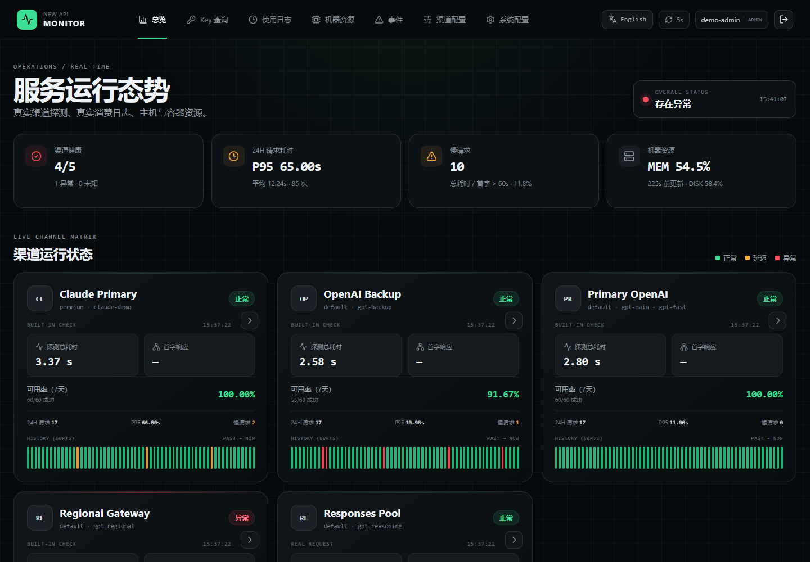
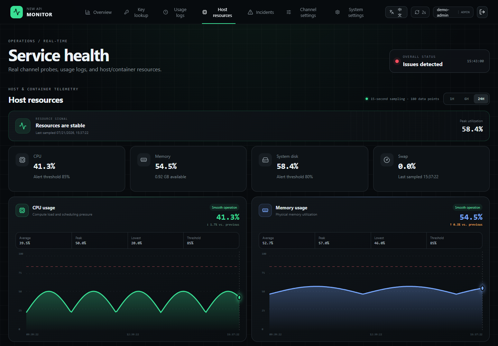
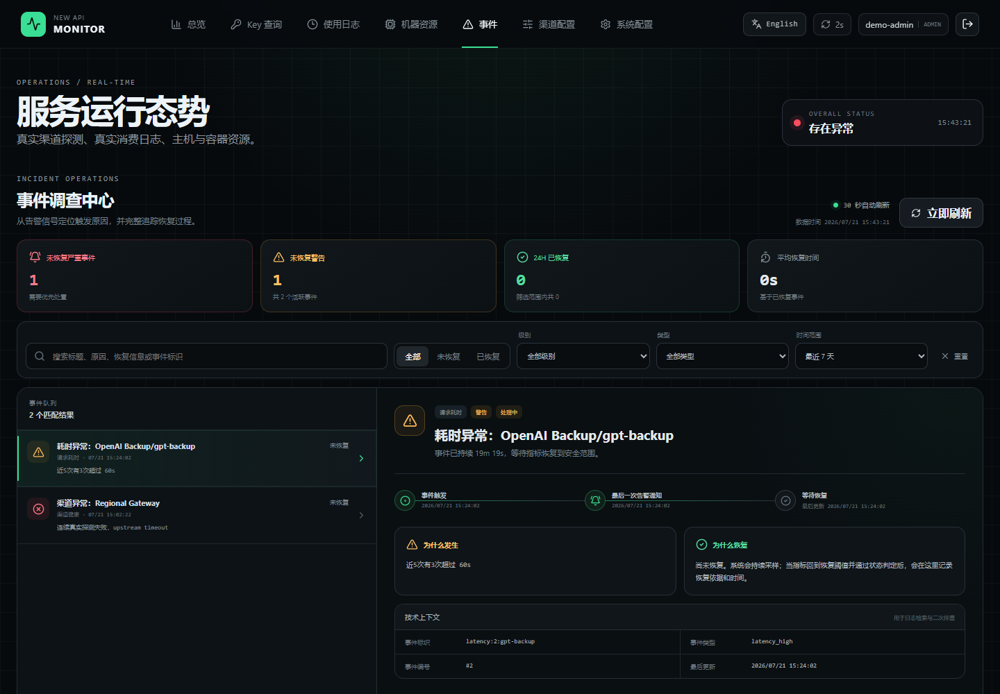
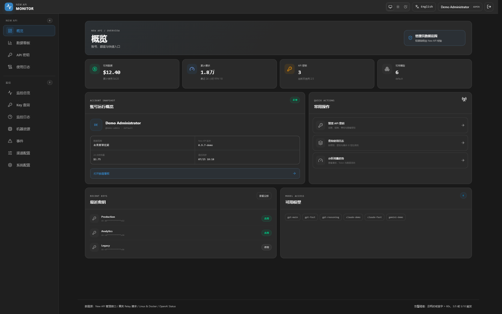

# New API External Monitoring Platform

[简体中文](README.md) | [English](README_EN.md)

[](https://github.com/li0on3/newapi-monitor/actions/workflows/ci.yml)
[](https://github.com/li0on3/newapi-monitor/actions/workflows/codeql.yml)
[](LICENSE)

An independently deployed monitoring and alerting platform for New API. It does not modify New API source code. Data is collected through read-only management APIs, real relay probes, real usage logs, and a restricted Docker Socket Proxy. The project is designed for single-host and small-scale New API installations.

## Screenshots

Every screenshot below is generated from the built-in synthetic demo dataset. It contains no real channels, users, API keys, domains, IP addresses, tokens, or request records.

### Channel overview



### Host and container resources



### Incident investigation



### New API pages



## Features

- Automatically synchronizes enabled New API channels and hides disabled channels.
- Performs real probes through OpenAI Responses, Chat Completions, and Anthropic Messages.
- Analyzes total latency, time to first token, users, tokens, models, and channels from real New API usage logs.
- Queries quota, model restrictions, and recent calls by API key without persisting the key or putting it in URLs or audit records.
- Uses a low-noise severe-experience policy by default: alerts only when at least 15 of the latest 20 measurable requests take over 15 seconds to produce the first token. A long total duration alone never triggers an alert.
- Alerts for channel unavailability only after 5 consecutive failed probes, or at least 5 failures in the latest 10 probes. Resource, collector, and provider-status anomalies remain visible as incidents but are not sent externally by default.
- Persists alerts to a SQLite delivery outbox before sending them independently to each destination. Failed deliveries use exponential backoff, survive process restarts, and become visible dead letters after the configured attempt limit.
- Gives administrators an Alert Delivery Center with pending, sending, delivered, dead-letter, and cancelled filters, full failure and retry context, single or bulk retry/cancel actions, and dead-letter recovery.
- Supports incident acknowledgement, global quiet hours, and scheduled per-channel maintenance windows. Quiet hours defer rather than discard messages, and monitoring resumes automatically when maintenance ends.
- Monitors host CPU, memory, disk, and Docker container status, resource use, restarts, and OOM events.
- Detects stale collectors so a live dashboard cannot silently hide a stopped collection pipeline.
- Supports email, WeCom applications, WeCom group bots, Feishu applications, and Feishu group bots with independent delivery and real test alerts.
- Uses the same conclusion-first, risk-prioritized, human-readable report across every notification channel; email also includes responsive HTML cards with a plain-text fallback.
- Reuses New API sessions for SSO, with role mapping, an emergency administrator, login throttling, and configuration auditing.
- Automatically follows the browser language for Chinese or English, with a persistent manual switch in the page header.
- Aligns the overall visual system with the New API default frontend and supports persistent System, Light, and Dark theme modes.
- Stores runtime configuration in the monitor database and never writes configuration back to New API.
- Presents Monitor Overview, account Overview, Analytics, API Keys, and real Usage Logs as independent top-level modules for regular users. Business data always comes from the current user's New API session and is not copied into a second customer database.
- Provides an interactive model-stacked Analytics trend with Requests, Tokens, and Spend metrics, plus peak, bucket average, model ranking, and usage-flow views.
- Supports API key create, edit, enable/disable, delete, batch delete, and one-time plaintext reveal. Plaintext keys are not stored in the monitor database, logs, audit records, or browser storage.
- Supports overlapping monitor-local key groups, so one key can belong to multiple reporting groups, plus 1/7/30-day real usage for each personal key and group. Custom key groups never change New API model routing, billing, or permissions.
- Lets administrators configure separate administrator and regular-user channel scopes for Monitor Overview without stopping probes, log collection, or alerts.
- Uses a neutral API Service Center identity for regular users, without New API branding or technical monitor modules; administrators and operators retain the full operations view.
- Synchronizes OpenAI status, components, and incidents from the official JSON feed. A dedicated page separates workload-relevant components from global incidents, while the overview keeps only a compact contextual hint and real local probes remain authoritative.

## Quick Start

### One-click Linux installation (recommended)

```bash
curl -fsSL https://github.com/li0on3/newapi-monitor/releases/latest/download/install.sh | sudo bash
```

If Docker is missing, review the [official Docker convenience script](https://get.docker.com) first, then opt in explicitly:

```bash
curl -fsSL https://github.com/li0on3/newapi-monitor/releases/latest/download/install.sh | sudo bash -s -- --install-docker
```

The installer verifies the release bundle SHA-256, pulls a pinned multi-architecture GHCR image, binds to `127.0.0.1:18081`, and prints a one-time 15-minute setup token, a generated emergency password, and an SSH tunnel command.

Open `http://127.0.0.1:18081/monitor/` and complete the wizard with the New API URL and administrator credentials. The New API password is only exchanged for required tokens and is never stored. Existing tokens can be supplied instead.

Daily operations are available through `sudo monitorctl status|doctor|logs|backup|update|rollback|reset-admin`. Use `sudo monitorctl renew-setup` only if the first-run token expires before setup is complete.

Source builds remain available by cloning the repository, running `python3 manage.py init`, and using `docker compose build monitor`.

Publish `/monitor/` through an HTTPS reverse proxy and forward every nested path.

```text
/monitor/                       Overview
/monitor/key-usage              API key usage lookup
/monitor/logs                   Usage logs
/monitor/resources              Host and container resources
/monitor/incidents              Incidents
/monitor/channels               Channel settings
/monitor/upstream-status        OpenAI official status
/monitor/system                 System settings
/monitor/system/notifications   Notification center
/monitor/system/providers       Upstream provider settings
/monitor/system/console         New API page settings
/monitor/console                Overview
/monitor/deliveries             Alert Delivery Center (administrators only)
/monitor/console/analytics      Analytics
/monitor/console/keys           API keys
/monitor/console/logs           Usage logs
```

Every configured notification channel can trigger a real test alert from the UI, even while the channel is disabled. Unsaved changes must be saved first so the test always uses the active configuration.

## Health Check

```bash
curl -fsS http://127.0.0.1:18081/api/health
```

Healthy response:

```json
{"status":"ok","timestamp":1784476800,"version":"1.12.1"}
```

Before the first-run wizard is completed, health returns HTTP 200 with `{"status":"setup_required","timestamp":1784476800,"version":"1.12.1"}` so orchestration remains healthy while collectors stay stopped. `version` comes from the read-only `VERSION` file inside the image and can be used for deployment and rollback verification.

HTTP 503 is returned when SQLite is unavailable, the monitoring worker has stopped, a collector has exceeded its dynamic stale threshold, the database exceeds its configured capacity, dead letters exist, or pending delivery is older than 15 minutes.

The overview also validates channel-catalog freshness. When synchronization is stale, the last snapshot remains available for diagnosis but is marked unknown instead of being presented as current health, with a direct interruption notice.

## Default Policy

| Item | Default |
| --- | ---: |
| Channel synchronization | 5 seconds |
| Usage log synchronization | 30 seconds |
| Resource sampling | 15 seconds |
| Real channel probes | 5 minutes |
| OpenAI official status | 60 seconds |
| Slow request | Any latency metric over 60 seconds |
| Slow-request display | Total or first-token latency above 60 seconds; dashboard statistics only |
| Severe first-token alert | At least 15 of the latest 20 measurable requests exceed 15 seconds |
| First-token recovery | 10 consecutive first-token responses at or below 15 seconds |
| Channel unavailable | 5 consecutive failures, or at least 5 failures in the latest 10 probes |
| Channel recovery | 5 consecutive successful probes |
| Other anomalies | Retained as incidents; not sent externally in severe-experience mode |
| Raw sample retention | 90 days |
| Resolved incident retention | 365 days |
| Delivered/dead-letter retention | 30 days |
| Database maintenance | Every 6 hours |
| Database capacity alert | 2048 MB |
| Maximum delivery attempts | 8 |

## Data and Security

- Prompt and response bodies are not stored. Only monitoring metrics and bounded error summaries are retained.
- New API tokens, relay tokens, SMTP passwords, application secrets, webhook URLs, and signing secrets are encrypted in SQLite with `MONITOR_SECRET_KEY`.
- The production container runs as non-root UID `10001`, with a read-only root filesystem and all Linux capabilities removed.
- Docker access is restricted through a read-only Socket Proxy; the monitor does not mount the Docker socket directly.
- State-changing APIs require authentication, role checks, strict Pydantic schemas, and a same-origin request header.
- Regular New API users are identified live from their existing session and can access only the viewer-filtered Monitor Overview plus their personal Overview, Analytics, API Keys, and Usage Logs. New API Admin and Root accounts automatically become monitor administrators with access to every monitor module.
- New API page access requires a New API session. Monitor roles only control entry visibility; global versus self-only data remains governed by the original New API role. Emergency administrators cannot access these business pages.
- Deploy the New API pages on the same browser Origin as New API (preferably under `/monitor/`) so the browser can reuse both the New API Session and `uid`.
- After monitor sign-out, refresh does not silently reuse a remaining New API session. The user must explicitly choose “Sign in with New API”; this affects only monitor authentication and never signs out of or modifies New API.
- The console BFF exposes only fixed New API API routes and never accepts arbitrary upstream URLs, paths, or headers. Regular users can query at most 30 days per request.
- Customer business data is read on demand and is not persisted by the monitor. Plaintext keys exist only in the explicit one-time reveal response, and customer-data APIs are non-cacheable.
- Custom key groups store only names, colors, and membership isolated by `user_id + token_id + group_id`. One key may belong to multiple groups; account totals remain deduplicated, while overlapping group totals must not be added together.
- API key usage lookup is admin-only by default, can be lowered only to operators, is rate-limited, and calls only New API read-only endpoints.
- Configuration and role changes are audited, with secrets always masked.
- Each OpenAI collection cycle only reads the fixed official `https://status.openai.com/api/v2/summary.json`, enforces response-size and timeout limits, and never accepts a configurable URL, preventing SSRF abuse.
- Only the latest official-status snapshot is retained; incident progress is stored separately in the incident workspace, preventing unbounded SQLite growth at a 60-second polling interval.
- Raw samples, resolved incidents, and notification delivery records have independent retention policies. Periodic pruning and WAL checkpoints bound storage growth, while System Settings shows database/WAL size, pending deliveries, and dead letters.
- Log history uses ordered composite indexes for time and filter dimensions. Resource history aggregates bounded numeric buckets and returns the end-of-range container snapshot only on the final point, so long ranges do not depend on a large temporary filesystem.

See [Data definitions and accuracy](docs/DATA_ACCURACY_EN.md) for authoritative sources, time ranges, attribution differences, and acceptance rules. See [New API pages architecture](docs/CUSTOMER_CONSOLE_EN.md) for API mapping, permission boundaries, and compatibility policy. See [SECURITY_EN.md](SECURITY_EN.md) for the wider security boundary, [ROADMAP_EN.md](ROADMAP_EN.md) for planned work, and [GITHUB_GUIDE_EN.md](GITHUB_GUIDE_EN.md) for the protected-branch workflow.

## Backup

```bash
sudo monitorctl backup
```

Backups use the SQLite Online Backup API and package the permission-restricted environment. Restoring encrypted configuration also requires the original `MONITOR_SECRET_KEY`. Never commit backups, `.env`, or reverse-proxy credentials.

## Upgrade and Rollback

```bash
sudo monitorctl update
# If the new release regresses:
sudo monitorctl rollback
```

One-click deployments pin GitHub Release images, create a backup before upgrading, and record the previous image. Confirm database compatibility or restore the matching backup before a major-version rollback.

## Development Verification

```bash
python -m pip install -r requirements.txt
python manage.py release-check
python -m unittest discover -s tests -v

cd web
bun install --frozen-lockfile
bun run test
bun run build
bunx playwright install chromium
bun run test:e2e
bun run test:e2e:fullstack

cd ..
docker compose --env-file .env.example config --quiet
docker build -t newapi-monitor:test .
```

## Design Principles

1. **Measure the real target:** channel health is based on real relay behavior, not connectivity alone.
2. **Monitor the monitor:** every collector records freshness and produces failure and recovery incidents.
3. **Least privilege:** read-only APIs, dedicated probe tokens, non-root containers, loopback binding, and minimal Docker access.
4. **Failure isolation:** monitoring failures must never modify or block New API traffic.
5. **Avoid premature complexity:** SQLite and a single-process scheduler are intentional for small deployments; external time-series databases and queues should only be introduced when capacity or reliability requirements justify them.

An on-host monitor cannot detect a complete host or network outage. Add an independent external HTTP heartbeat when host-down alerting is required.
